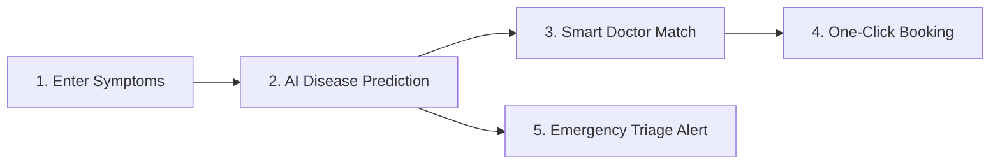
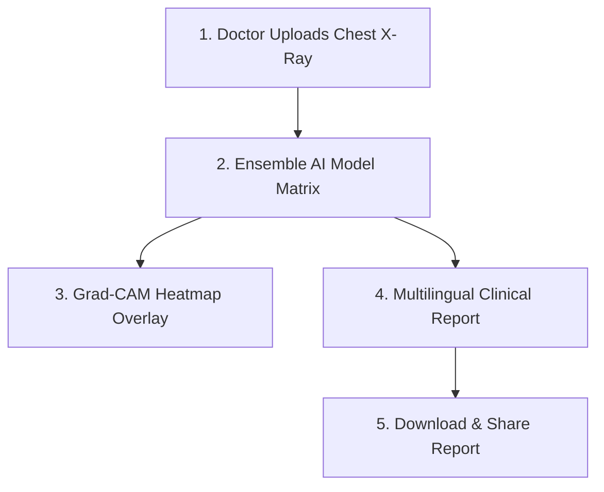

# 🏥 HealthAI Pro - Unified Healthcare Intelligence Platform
## Comprehensive System Report & Ecosystem Impact

> **Note:** This report details the functional architecture, patient/doctor capabilities, underlying technology workflows, and ecosystem benefits of the **HealthAI Pro** platform.

---

## 1. Executive Summary: Transforming Healthcare Delivery
**HealthAI Pro** is a next-generation, market-ready digital health ecosystem designed to address critical friction points in patient care, clinical workload, and hospital resource dispatch. By integrating advanced **Multi-Agent AI Orchestration**, **Machine Learning Radiology Diagnostics**, **Dynamic Priority Triage Scheduling**, and **Multilingual Public Health Support**, the platform serves as a unified intelligence layer connecting patients, physicians, and emergency response coordinators.

---

## 2. What the Platform Does for Patients

The patient portal empowers individuals to take control of their health journey with intuitive, accessible, and high-fidelity tools.

### 🧠 Multilingual AI Symptom Checker & Assistant
*   **Conversational Assistant:** Patients can query the AI assistant in **English, Hindi, Spanish, Marathi, or Gujarati** regarding common infections, hygiene, water safety, vaccine availability, diabetes, and hypertension.
*   **Accessibility First (Text-to-Speech):** Fully integrated speech synthesis allows the platform to speak answers aloud in the patient's native language, helping low-literate or visually impaired users.
*   **Emergency Interception:** The assistant dynamically scans conversational inputs for high-risk flags (e.g., chest pain, severe shortness of breath). If detected, it immediately provides emergency instructions, directs the patient to the nearest ER, and bypasses general triage.

### 🩺 Advanced Disease Prediction
*   **Bayesian Inference Engine:** Computes a diagnostic profile based on symptoms and lifestyle factors, yielding predicted conditions alongside a **confidence score (%)** and **severity level** (Low, Medium, High, Critical).
*   **Pre-defined Quick-Add Symptoms:** Allows one-tap selection of common indicators (fever, cough, chest pain, fatigue) for rapid profiling.

### 📅 One-Click Doctor Matching & Appointment Booking
*   **Specialty Alignment:** The system automatically analyzes the predicted condition and matches the patient with the **top 3 local specialists** (e.g., recommending Pulmonologists for pneumonia).
*   **Real-time Availability:** Displays doctors' experience, ratings, clinic locations, consult fees, languages spoken, and next available slots.
*   **Instant Confirmation:** Patients can schedule an in-person or video consultation in one click, receiving instant digital confirmations.

### 🏥 Real-time Resource & Blood Bank Locator
*   **Hospital Dispatch Data:** Patients can search and view available general beds, ICU rooms, and specific blood stocks (A+, O-, AB+, etc.) across nearby healthcare centers before leaving their homes.

---

## 3. What the Platform Does for Doctors & Clinical Coordinators

For healthcare providers and clinical administrators, HealthAI Pro acts as a high-throughput diagnostic workstation and operational command center.

### 🔬 ML Radiology Analysis Hub
*   **Ensemble AI Inference Matrix:** Supports uploading PNG, JPG, or DICOM scans. The system passes images through a mock-fallback ensemble of **DenseNet121**, **ResNet50**, and **EfficientNetB4** models to cross-verify findings (Pneumonia, TB, Normal, etc.).
*   **AI Heatmap Visualizer:** Generates Grad-CAM visual overlays highlighting localized diagnostic regions of interest.
*   **Multilingual Clinical Reports:** Automatically compiles formal clinical findings, severity ratings, and recommendations, instantly translatable into English, Hindi, Tamil, or Telugu for patient sharing.

### 🚨 Dynamic Triage Queue Dashboard
*   **Risk-Priority Scheduling:** Places incoming patients into a dynamic priority queue sorted by an algorithmic risk score (0-100) and priority level (`Critical`, `High`, `Medium`, `Low`).
*   **Smart Wait Time Forecasts:** Calculates wait times cumulatively based on triage severity (e.g., Critical patients bypass wait times, while low-severity patients are allocated scheduled ambulatory slots).
*   **Patient Status Resolutions:** Provides coordinators the ability to review, admit, discharge, or resolve patients from the queue in real-time, feeding satisfaction logs.

### 📊 Hospital Load Forecasting & Analytics
*   **Tomorrow Load Predictor:** Displays predictive satisfaction ratios, ICU occupancy rates, and average wait times.
*   **Comparative Analytics:** Includes interactive area, pie, and bar charts tracking weekly patient volume, satisfying satisfaction KPIs, department satisfaction scores, and disease distribution frequencies.
*   **Electronic Health Records (EHR):** Digital twins of patients with updated BP, Heart Rate, Temperature, medical condition history, active prescriptions, and appointment timelines.

---

## 4. How the Platform Works Under the Hood

The platform relies on a clean, scalable architectural design:

| Layer | Technology | Primary Function |
| :--- | :--- | :--- |
| **Frontend UI** | React 18, Recharts, Lucide Icons, Vanilla CSS | Premium Glassmorphism UI, Responsive Viewports, Data Charts |
| **Backend API** | FastAPI (Python) | High-performance, asynchronous endpoints with automated Pydantic validation |
| **Orchestrator** | Multi-Agent AI Agents | Coordinates clinical logic between symptoms, doctors, and medicines |
| **Data Engine** | In-memory Database Manager | Handles relational entities (patients) and time-series logs without Docker dependencies |

### 🛠️ Key Architectural Flows
1.  **Bayesian Predictor:** Matches user symptom profiles against statistical patterns to forecast likely illnesses.
2.  **Specialist Engine:** Maps predicted disease entities to medical specialist taxonomies to find compatible local practitioners.
3.  **Hospital Scoring System:** Ranks hospitals using a dynamic resource scoring algorithm:
    $$\text{Score} = \text{Base Match (60)} + \text{Specialty Match (20)} + \text{ICU Bed Availability (15)} - \text{Distance Penalty}$$

---

## 5. Summary of Benefits to the Healthcare Ecosystem

*   **Bypassing Emergency Bottlenecks:** Real-time triage ensures critical cardiovascular or respiratory patients receive immediate care guidelines and booking priority, saving lives.
*   **Optimized Resource Allocation:** Coordinators can dispatch incoming ambulances to hospitals with confirmed ICU beds and matching blood types, avoiding redundant patient transfers.
*   **Multilingual Accessibility:** Breaks language barriers in diagnostics and healthcare education, supporting underserved rural populations.
*   **Reducing Diagnostic Backlogs:** AI radiology pre-screenings and automated translation tools allow clinical staffs to evaluate x-rays and construct reports in seconds.
